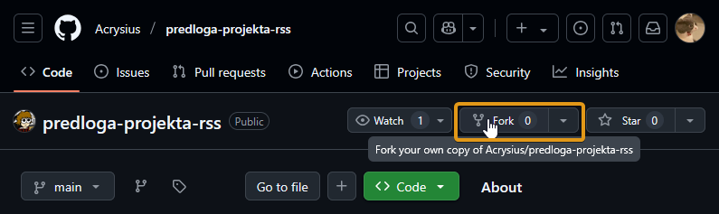
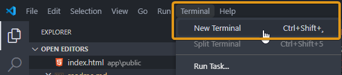

# NAVODILA ZA UPORABO PREDLOGE DOCKER
ZA delovanje sledečega boste potrebovali nameščeno zadnjo različico Docker Desktop, ki jo najdete na sledeči povezavi:
- [Windows 10 ali 11](https://desktop.docker.com/win/main/amd64/Docker%20Desktop%20Installer.exe?utm_source=docker&utm_medium=webreferral&utm_campaign=dd-smartbutton&utm_location=module)
- [MacOS - Apple Silicon čip](https://desktop.docker.com/mac/main/arm64/Docker.dmg?utm_source=docker&utm_medium=webreferral&utm_campaign=dd-smartbutton&utm_location=module)
- [MacOS - Intel čip](https://desktop.docker.com/mac/main/amd64/Docker.dmg?utm_source=docker&utm_medium=webreferral&utm_campaign=dd-smartbutton&utm_location=module)
- [Linux](https://docs.docker.com/desktop/setup/install/linux/)
>  Linux omogoča namestitev preko konzole, slednja navodila so za Ubuntu sistem:
>
> sudo apt-get update
> sudo apt install docker
>
>Edino bodite pozorni, da vsak Docker ukaz pričnete s **sudo**, saj deluje samo z ukazi na *root-u*. Vašega uporabnika lahko dodate kot člana skupine Docker, kar je razloženo na [Dockerdocs](https://docs.docker.com/engine/install/linux-postinstall/).

## DOCKER COMPOSE
Datoteka *docker-compose.yml* ima definirane parametre za strežniško arhitekturo, PHP okolje in MySQL. Različice so večinoma najnovejše. Spremenite lahko **SAMO** ime glavne mape (v tem primeru, *predloga-projekta*). Vse ostale datoteke naj ohranijo imena, kot so zastavljena.

### ZAGON
Z vzpostavljenim Github Desktop *povilicajte* (fork) [predlogo](https://github.com/Acrysius/predloga-projekta-rss) projektne mape in definirajte ime ter željeno mesto, kjer jo boste na sistemu hranili.
**POZOR!** Ko je projektno mesto enkrat definirano, tiste mape več ***NE PREMIKAJTE!***

V **Visual Studio Code** (zelo priporočeno) odprite mapo projekta:
> File -> Open folder ...

Sedaj lahko odprete konzolo:
> Terminal -> New Terminal

Ko prvič naložite projektno mapo na računalnik, je vedno treba zapisati sledeči ukaz:
> docker compose build

Slednje bo sestavilo strežnik za razvoj. Počakamo, da Docker naloži datoteke, ki jih zahteva datoteka *compose*. Da zaženemo strežnik z nastavljenimi parametri, izvedemo sledeči ukaz:
> docker compose up

Docker bo zagnal storitve vseh zabojnikov, navedenih v datoteki *compose* in sedaj si lahko ogledamo izdelek. Predloga je nastavljena tako, da se kot jedrna mapa ***zaganjanja spletišča*** identificira kot *public*. Vanjo tudi nalagamo vse datoteke, ki jih želimo izvajati in prikazati na spletni strani. Iz mape *public* lahko pobrišete ikono (favicon.ico) in nastavite svojo.

## ODPIRANJE SPLETNEGA MESTA
če želite v brskalniku odpreti datoteko na Docker strežniku, jo morate obvezno odpreti v brskalniku (in ne z dvojnim klikom na datoteko). Tukajšen sistem je nastavljen tako, da se spletna stran odpre, ko vtipkate v iskalnik brskalnika sledeči niz in nato pritisnete ENTER:
> Windows: 127.0.0.1
>
> Linux: 0.0.0.0
>
> MacOS: Ne vem, ne morem testirati.

## ZAUSTAVITEV STREŽNIKA

Če želite ustaviti izvajanje strežnika, se soredotočite na konzolo in in pritisnice **CTRL-C** (MacOS sistemi imajo drugače, spet odvisno od različice).

